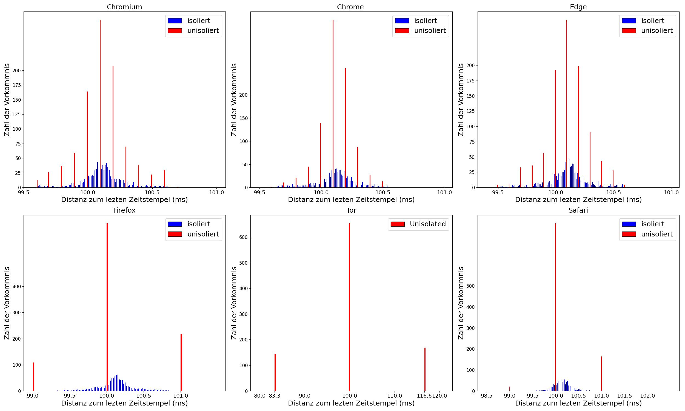

# Zeistempeldifferenzen zwischen nativer Anwendung und Browser

- Differenzen zwischen Zeitstempeln gemessen in nativer (Rust) Anwendung und Browser sind minimal (durschnittlich ca. 500 Microsekunden)

- Zeitstempel im Browser wurden im isolierten Seitenzustand gemessen, um eventuelle Modifikationen der Zeitstempel durch den Browser zu verhindern

----
## Sonderfälle Tor und Firefox "resistFingerprinting"

### Tor
- im Tor-Browser ist es (mit den Standarteinstellungen) nicht möglich, eine Seite im isolierten Zustand aufzurufen

- Zeitstempel wurden daher auf einer unisolierten Seite gesammelt

- Differenz der Zeitstempel aus nativer Anwenund und Browser sind entsprechend größer, da der Browser die Zeitstempel stark modifiziert (Differenzen zwischen 2ms - 10ms)

### Firefox

- im Firefox-Browser ist es über die Einstellung "resistFingerprinting" möglich, die Präzision von Zeitstempeln weiter zu reduzieren
  
### Vergleich zu anderen Daten

----
# Zeitstempelproben aus Browsern

- es wurde Versucht, Unterschiede bei Zeitstempeln in isolierten Seitenzuständen und unisolierten Seitenzuständen deutlich zu machen

- einige Browser erlauben präzise Zeitstempel im isolierten Seitenzustand (Abweichung bis <1ms ), beschränken die Präzision von Zeitstempeln im unisolierten Seitenzustand jedoch auf 100 Microsekunden

- beim Vergleich der Daten vom Chrome, Chromium und Edge-Browser wird deutlich, dass aktuelle Versionen alle auf Chromium basieren und daher ein sehr ähnliches Profil aufweisen

# Firefox resistFingerprinting

- Firefox ermöglicht es, durch einfache Konfiguration, die Modifikationen von Zeitstempeln zu beeinflussen
- die Konfigurationsmöglichkeit "resistFingerprinting" schränkt die Präzision von Zeitstempeln start ein (vergleichbar mit Tor-Browser, Präzision von ca. 10m)

# Zeistempelproben aus Browsern mit verschieden Lasten

- um zu überpüfen, wie sich die Präszision von Zeitstempel verhält, während der Browser genutzt wird, wurden verschiedene Szenarien simuliert, in welchen der Browser zusätzliche Aufgaben zuerfüllen hat

- diese Aufgaben waren
  - das asynchrone laden von Datein
  - das abspielen von 5 hochauflösenden Videos
  - das ausführend einer Grafikanwendung

- zusätliche Aufgaben des Browsers beeinflussen die Präszision von Zeitstempeln nur sehr minimal

## Firefox 

## Edge

## Chrome

## Chromium

## Tor

## Safari

# Password Simulation / Kontinuierliche Authentifikation