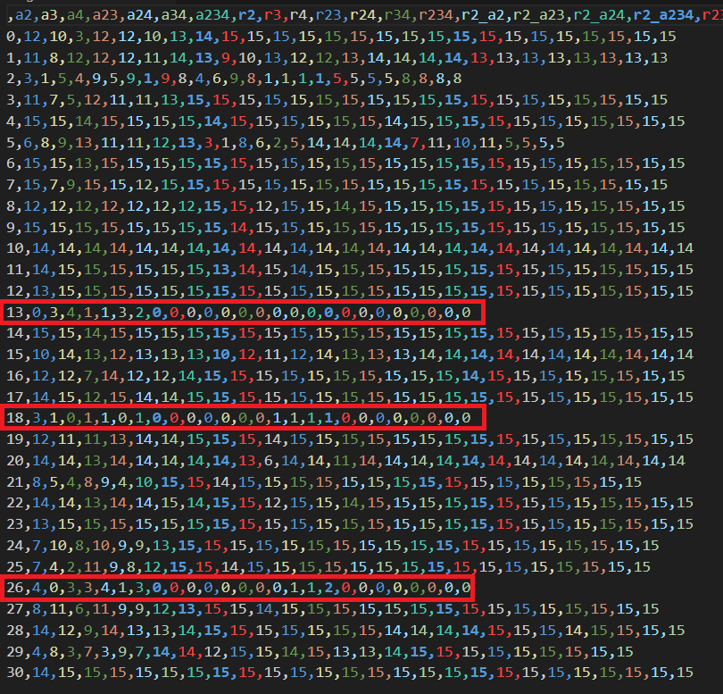
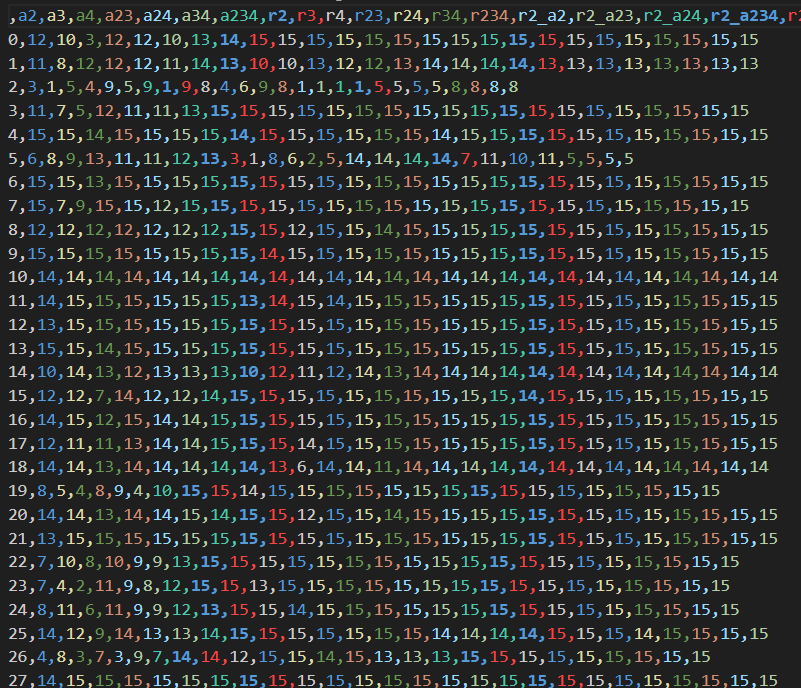
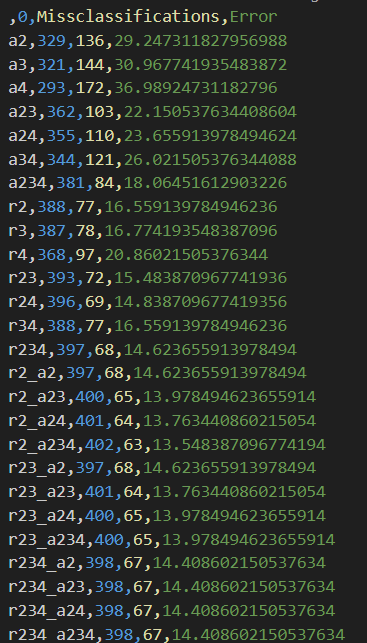
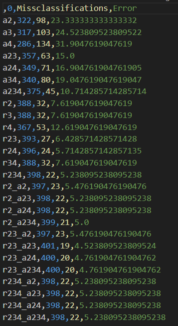
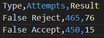
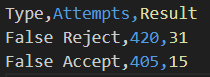
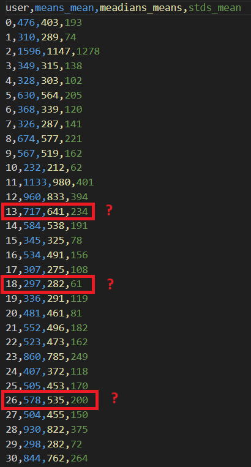
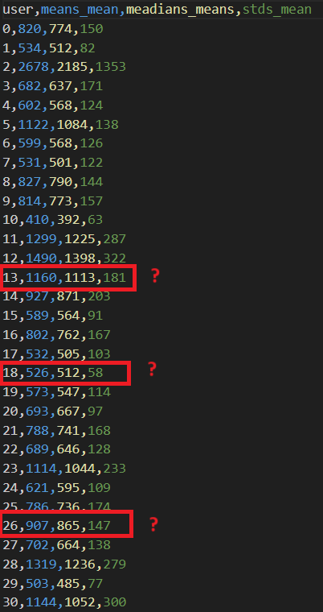
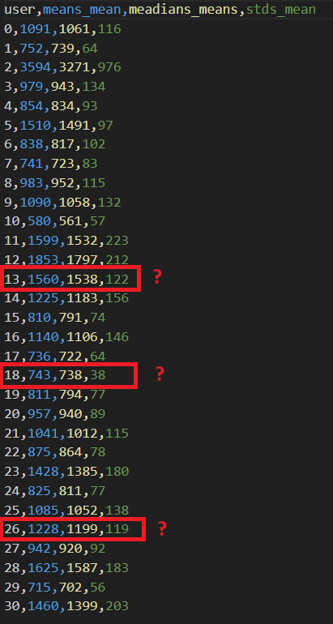

# Problem

|       | Data with 31 User   | Data with 28 User |
| ------| -------- | ------- |
| classification |     |  |
| classification perf |    |    |
| authentification |   |    |

### Notes
- classification performance is better for r2, r3, r4 (and the combinations based on them)
- the classification performance for a2, a3, a4 is also better
- (r2, r3, r4) and (a2, a3, a4) are independant

## User Data

### Digraphs (2-graphs)

### Trigraphs (3-graphs)

### Fourgraphs (4-graphs)

## r-distance

## a-distance
- a-distance implementation: subtraction => division
- classification implementation: mean distance

# Sending Keystrokes over network

## Design
- using websockets:
  - *connection in user space (not managed by browser)*
  - *reliable (no UDP => using Keystrokes is unacceptable)*
  - *minimal parsing overhead (no HTTP header etc.)*
  - *browser build in*

## Problems Browser
- when to open network socket (loading page without logging in) 
- how to match incoming keystroke stream to user, when user is logging in right now(no valid session)
  - *generate private uuid for each page load, that gets send with keystrokes and login data*
  - *send login data over websocket connection*
- network/async browser | keystrokes don't have to arrive in right order
  - *counter for each message*

## Problems Analysis
- variable network latency
  -  *error margin based on ttl* (better not)
  -  *measure round trip time from server to client to server at connection start*
  -  estimated performance similar to browser with low timestamp modification
  -  any mitigation strategy can most likely be abused

# Different Thought

## Free Text Auth
- save classifikation on authentification
  - saves computation
  - not really nessary (without )